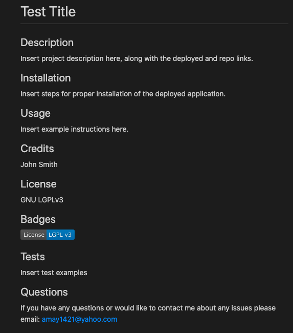

# ReadMe-Generator

This application is a tool for web developers to easily generate a working ReadMe file. It uses the inquirer package to ask the user various questions in order to create a professional looking READme file.

<strong>Repo Link:</strong> https://github.com/amay1421/ReadMe-Generator
<strong>Link to Video:</strong> https://drive.google.com/file/d/1q0GKn2uP8JmwQEKg07K-V5YqdPOG7JZ3/view?usp=sharing